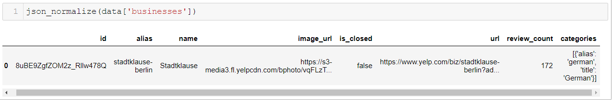
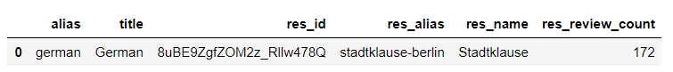

PROJECT STILL IN PROGRESS


# ETL Pipeline with Postgres
For this project we apply data modeling using python. We will create an **ETL** pipeline to **E**xtract  information for all restaurants from  [Yelp](https://www.yelp.de/berlin) in the area of Berlin. We **T**ransform the data using a pipeline with python and finally we **L**oad the data into an SQL database, cleaned and ready for analysis.

## Enter Pipeline
The solution to this problem is a data pipeline. Like a physical pipeline system which drives the flow of any material from the source to the destination, a data pipeline comes to transfer the flow of data from any source to the desired destination. But not only that, it can make all the necessary transformations -while transferring the data- so the data reach their destination in the desired format and ready to be analyzed.

[](Pipeline)

The diagram above shows a simple explanation of what a pipeline is. In its simplest form, it's just a command that reads some data from a source, and applying or not some transformations drives the data to some source or even to another pipeline.

# Project Background
The case scenario of this project is as follows:  

> We work for a small startup, and they want  to develop new services
> into the food industry. They need an efficient way to get all
> information about the restaurants in area of Berlin and run some
> analysis to see in  which  category of restaurants the people tend to
> eat and leave more positive reviews.

The Pipeline for this project will look as follows:

[](Pipeline)

# Connect to the database
For this project, I choose to work with PostgreSQL and I used the [Psycopg](https://www.psycopg.org/docs/index.html) python library to connect to and execute queries to my database. This library works only if we have the DB already created.  This step is already done using the [pgAdmin](https://www.pgadmin.org/) tool.  I named the database `yelp_restaurants` and it's the last time I used this tool for transactions with my DB. 

The python file `make_tables.py` it makes the connections and creates all the tables that will be needed for this project. We have only to run the file but first, we need to export into the environment all the parameters used for the connection such as the database name, password, host, etc.  For this reason, I created the `export_to_environment.bat` to set automatic all for me.

# Create the tables
If we run the `make_tables.py` file will create all the tables for us. The logic behind the tables is a normalized schema where we have a table for the location only, using the Zip code as primary key, a table for the categories of the restaurants, and lastly a table with all the restaurants with their respective information. Here we can also run the SQL code in the server but I used a more pythonic way and run the code using the Postgres library for python

# Data format and the Transform process
The data we receive from the API are in JSON format and looks like this:

```json
{
"businesses": [
{
"id": "8uBE9ZgfZOM2z_Rllw478Q",
"alias": "stadtklause-berlin",
"name": "Stadtklause",
"image_url": "https://s3-media3.fl.yelpcdn.com/bphoto/vqFLzToYyFfAoYKlBRq0jA/o.jpg",
"is_closed": false,
"url": "https://www.yelp.com/biz/stadtklause-berlin?adjust_creative=N9q5J26XY3aaHLZrjJ7g7g&utm_campaign=yelp_api_v3&utm_medium=api_v3_business_search&utm_source=N9q5J26XY3aaHLZrjJ7g7g",
"review_count": 172,
"categories": [
{
"alias": "german",
"title": "German"
}]}]}
```
So we have to grab the `business` part and then read each key, value pair and load it into a pandas data frame. The problem now is that the JSON is deep nested. That means we have dictionaries nested into the data which we have to iterate again to receive the key, value pairs. If we read the data as it is it will look like this:



Clearly we can see there are columns with dictionaries as entries. That's we can fix using a more complex way to read the JSON file.

   ```python
  json_normalize(data['businesses'], sep="_",
				record_path=record_path,
				meta=meta,
				meta_prefix=meta_prefix,
				record_prefix=record_prefix
  ```



More about how this works, in [documentation](https://pandas.pydata.org/pandas-docs/stable/reference/api/pandas.json_normalize.html).


