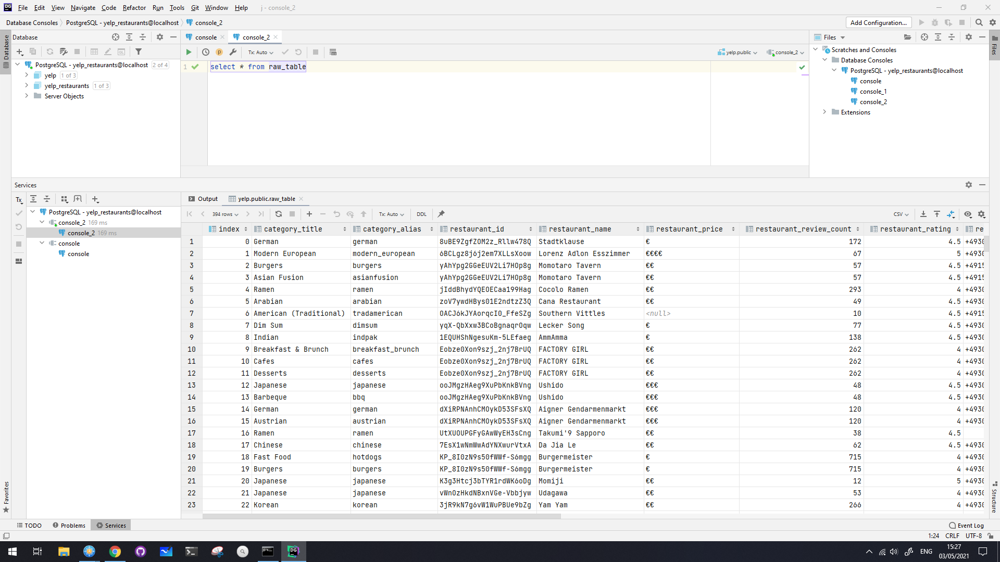
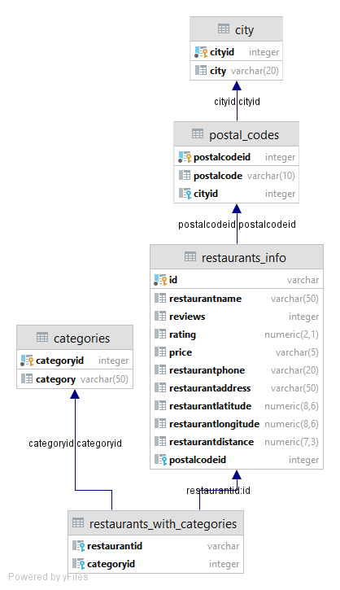

# ETL Pipeline with Postgres

For this project, we apply data modeling using python. We will create an **ETL** pipeline to **E**xtract information for
all restaurants from  [Yelp](https://www.yelp.de/berlin) in the area of Berlin. We **T**ransform the data using a
pipeline with python and finally we **L**oad the data into an SQL database, cleaned and ready for analysis.

## Enter Pipeline

The solution to this problem is a data pipeline. Like a physical pipeline system that drives the flow of any material
from the source to the destination, a data pipeline comes to transfer the flow of data from any source to the desired
destination. But not only that, it can make all the necessary transformations -while transferring the data- so the data
reach their destination in the desired format and ready to be analyzed.

<p align="center">
    
</p>

The diagram above shows a simple explanation of what a pipeline is. In its simplest form, it's just a command that reads
some data from a source, and applying or not some transformations drives the data to some source or even to another
pipeline.

# Project Background

The case scenario of this project is as follows:

> We work for a small startup, and they want  to develop new services
> into the food industry. They need an efficient way to get all
> information about the restaurants in the area of Berlin and run some
> analysis to see in  which  category of restaurants the people tend to
> eat and leave more positive reviews.

The Pipeline for this project will look as follows:

For this project, the source is just an API and the destination would be a Postgres SQL database. So the pipeline for
this project would look like this

<p align="center">
    
</p>


Each API lets us make some GET/POST requests and sends back to us a payload with the appropriate information depending
on what we send it. The logic behind each API is the same but each one uses a unique style of commands that need to be
sent with each request to receive the correct response.

Yelp's API has the following format

```python
 response = requests.get(api_url, params=params, headers=headers)
```

In the params dictionary, we have to define what do we want to look for, for this case it would be the following

```python
params = {"term": "restaurants",
          "location": "berlin"}
```

Passing to the key terms: `term`:`restaurants` and `location`:`Berlin`, we ask the API to look for the term restaurants
located in Berlin.

The request is almost ready, it requires more information. Although it's a public API, someone must be registered to use
the API. After registration you will receive a KEY, this key should be passed to the request with the following text
into the headers like this

```python
headers = {"Authorization": "Bearer {}".format(api_key)}
```

# Connect to the API

As was said before, to make a request we need some credentials it is wise not to share in public projects. There a lot
of ways to hide this from the public. I will demonstrate two of them.

**Extract credentials to the environment**

This way demands the creation of a bat file with all the commands needed to set a variable to the local environment,
after doing that it is easy to retrieve this information in our code without fear of revealing it to the public.

*.bat file
> ```cmd
>set API_KEY = 'my-private-key'
>```

Run the file
> ```cmd
>my_bat.bat
>```

**Make a file and import it in your project**

This way is kind of more pythonic. It takes only the creation of a new file where each variable will have the values of
some value needed for our project and has to stay private.

environment_consts.py file
> ```python
>API_KEY = 'api key'
>```

Project file
> ```python
>from environment_consts import API_KEY
>```

# Connect to the database

For this project, I choose to work with PostgreSQL and I used the [Psycopg](https://www.psycopg.org/docs/index.html)
python library to connect to and execute queries to my database. We can execute SQL queries either using
the [pgAdmin](https://www.pgadmin.org/) tool or using python.

If we want to run out DB from python we need to export into the environment all the parameters used for the a connection
such as: *the database name*, *password*, *host*, *, etc*, but this step is already completed.

To execute a query from python we need to make a connection with the DB, after that, we create a `cursor`, an object
that deals with the execution of each query. In the end, we need to close the connection. For our luck pandas supports
the transfer of a data frame to SQL database automatically but only using the SQLAlchemy library. For only this step we
have to use this specific library

# Data format, and the Transform process

The data we receive from the API are in JSON format and looks like this:

```JSON
{
  "businesses": [
    {
      "id": "8uBE9ZgfZOM2z_Rllw478Q",
      "alias": "stadtklause-berlin",
      "name": "Stadtklause",
      "image_url": "https://s3-media3.fl.yelpcdn.com/bphoto/vqFLzToYyFfAoYKlBRq0jA/o.jpg",
      "is_closed": false,
      "url": "https://www.yelp.com/biz/stadtklause-berlin?adjust_creative=N9q5J26XY3aaHLZrjJ7g7g&utm_campaign=yelp_api_v3&utm_medium=api_v3_business_search&utm_source=N9q5J26XY3aaHLZrjJ7g7g",
      "review_count": 172,
      "categories": [
        {
          "alias": "german",
          "title": "German"
        }
      ]
    }
  ]
}
```

So we have to grab the `business` part and then read each key, value pair and load it into a pandas data frame. The
problem now is that the JSON is deep nested. That means we have dictionaries nested into the data which we have to
iterate again to receive the key, value pairs. If we read the data as it is it will look like this:


We can see there are columns with dictionaries as entries. That's what we can fix using a more complex way to read the
JSON file.

   ```python
  json_normalize(data['businesses'], sep="_",
                 record_path=record_path,
                 meta=meta,
                 meta_prefix=meta_prefix,
                 record_prefix=record_prefix
  ```


More about how this works,
in [documentation](https://pandas.pydata.org/pandas-docs/stable/reference/api/pandas.json_normalize.html).

# Final step

After loading the raw data into the database we can use any DBMS for further analysis or to normalize the raw table

<p>
    
</p>

**Database in final form after normalization**

<p align="center">
    
</p>
