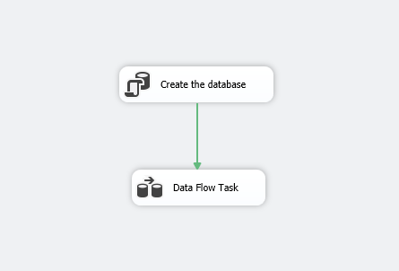
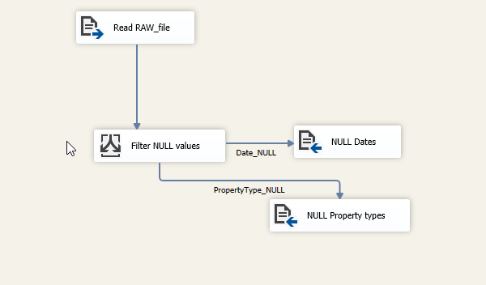
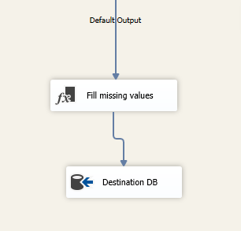
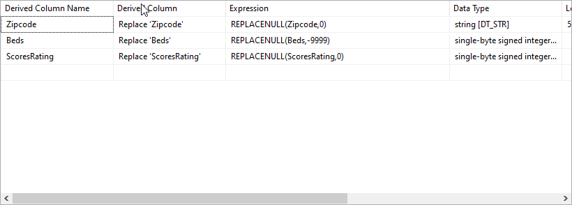
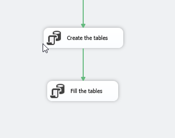
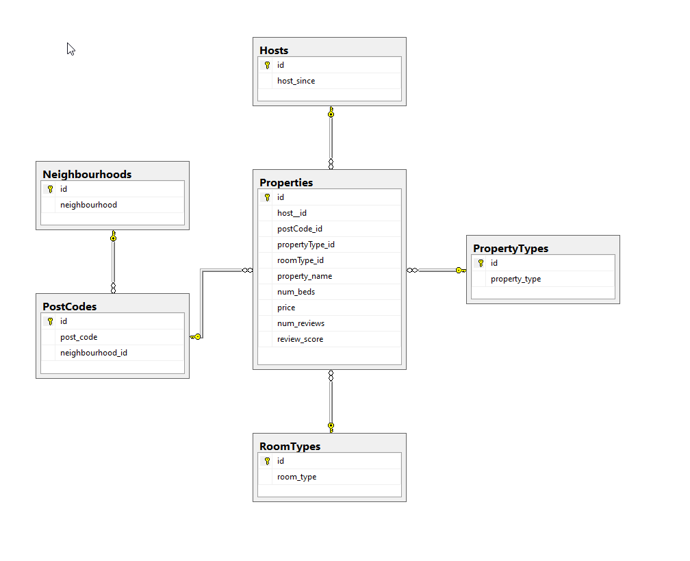
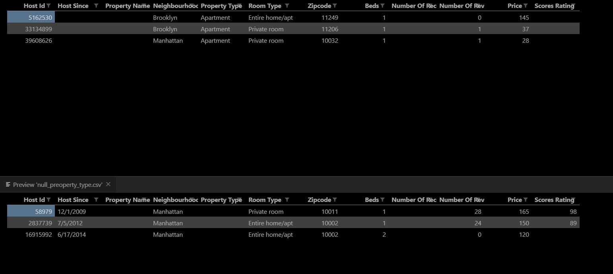
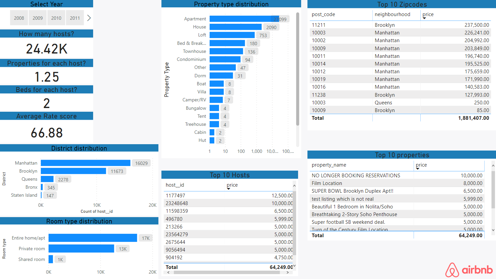
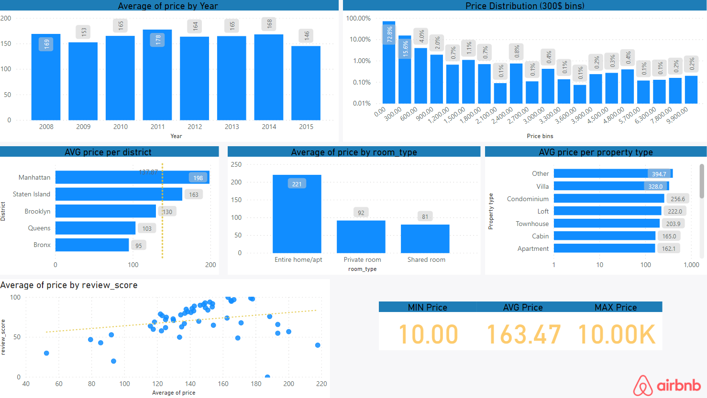

## Project: Visualizing Airbnb dataset

### Goal: 
We have a dataset of Airbnb users in a excel sheet and we want to understand it and make a dashboard of all the important features.

## Background: 
We have a dataset from Airbnb with hosts and their properties. The dataset begins on June 2008 and goes till August 2015. We have 30478 entries of hosts in the New York area.

## Walkthrough:

I choose for this project to take another approach. First, I want to analyze the raw data (excel sheet) after that I'll use the SSIS tools from the Microsoft Visual Studio to create a database out of the data and try to clean them as well. Next, I will use the Microsoft Power BI to make a visual analysis of the data.

### Create the database
In the Visual Studio environment, I start creating the control flow. As the first step, I create a SQL task which will connect to my local server and then create an empty database.


```sql
-- This line of code will be executed from the SQL task.
CREATE DATABASE Airbnb_20191012;
```
### Create the data flow
Now that I have a database, I can read the raw file, make some controls, and some cleanup and then fill in the database with data that I can work with it.



The first problem I want to tackle is the Null values. After checking all the columns, I find out which of them has missing values. From these columns, I decided to drop out the entries with null values in `HostSince`  and `PropertyType` columns. The rest entries with missing values I found essential to keep and replace the NULL with something that makes sense for each feature.



As we see in the diagram above, we filter out all the entries that have missing Signup dates and property type. The records will be saved in a CSV file so we can examine later.



Now, this is how I choose to go with the rest of the missing values.
Zipcodes with null, replaced with 0. 

- The zip code may be not known, but the rest of the data are essential for the analysis, so replacing the NULLs with 0 is the right solution. Later, when we want to analyze the Zipcodes, we can filter out all the 0 values.

- The missing number of beds is also replaced with another numeric value, not 0 but -9999. This way, we create an outlier so we can easily filter them out. 0 is already used for some properties, so we want to keep them as clear as possible.

- The missing reviews are self-explained; we replace them with 0.



Through all these steps, the missing values will be handled, and the data will be ready for the next phase, where we will create the SQL tasks. 



The graph above shows two SQL tasks, one creates all the tables, and the other fills the tables with the appropriate data and with the proper relationships and constraints.

### Run the complete process
Now in this final step, I run all the tasks at once. 

- We have the creation of the database
- Clean up of the data and handle the missing values
- Create the tables with all the constraints
- Fill the tables with the appropriate data





## Visual analysis:

### Summary dashboard

Now that we are all set, its time for the visual analysis of the data.
I have created two dashboards; each one sees the dataset from a different angle. The first one is the [summary dashboard](Dashboards/visual_analysis_price.pbit), which shows the big picture. 





Its answers questions like, 

    - How many hosts are signed up till now?
	- What is the average number of properties for each host?
	- What is the average number of beds for each property?
	- What is the average rate score for all the properties

So with just a glimpse, we have all these questions answered. Now we can use this dashboard to make more out of it. We can see the distribution of the hosts in each of the districts. 

	Manhattan has most of the hosts, while the Bronx and Staten Island are the minority.

The room and property type distribution.

	We have more entire homes than shared rooms, with apartments, houses, or lofts to be the majority of the property type where cabins, huts, tents, etc. to be only a small fraction of the whole dataset.

The last significant value we can acquire from this dashboard is the top 10 entries in some of the essential features like zipcodes, host ids, or property ids. This way we can in only a few seconds answer questions like

    - Whos is the host with the maximum rent price?
    - Which property is the most highly rented?
    - Which area has the most expensive properties?

### Price analysis dashboard

Having concluded with the summary dashboard, its time to move on to the next one. The price [analysis dashboard](Dashboards/visual_analysis_price.pbit). Price is the most important metric that exists in our dataset, is our depended metric. It is the metric we want to watch out closely, so we instantly spot an outlier or an anomaly such as a host who tries to deceive some peopleor a new market pattern.



Looking at this dashboard, we acquire some useful information such as how the average price is changing throughout all the years, how the review score is correlated with the average price, how the property type or the room type changes the way a host charges for his property and lastly how the district influences the average price too. 

The things to take away from this graph are:

- The average price doesn't change so dramatically in all the years we have collected the data
- The price distribution shows that most of the properties are clustered around 0 - 300$ and also shows that there are some outliers in the data.
- Manhattan seems to be a district where prices are above average, while the Bronx seems to be the one with properties with the lowest price.
- Entire homes are rented twice as much as the other room types.
- Property type doesn't influence so much the price.
- Expensive properties seem to have better reviews.

### Conclusion

These reports can help us understand how hosts think when they put a price for their properties. We can find essential patterns and also train an algorithm to make some price recommendations to hosts if the global trend is changing. For example, if a host has an expensive property in manhattan, but the market is changing, and more cheap apartments are showing up, we can inform the host that maybe it is a good idea to change the price of the property.

## TOOLS

- Microsoft Power BI tool
- Microsoft Excel
- Microsoft SQL Server tools

## LINKS
[Video presentation of the results](https://www.loom.com/share/b6e7a7305df944dab7e9857b966253a9)
