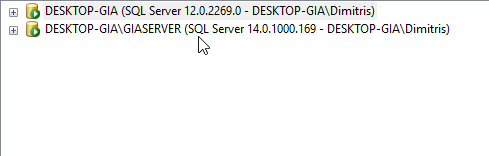

**CASE**:
***
Read - replica database on the same machine. Replication needs to be as real-time as possible

**Solution**:
***
Using the SQL Management Studio we can configure a system which can perform `Replication`.

The meaning of a system like this is that in many cases as in our own we have a company with a big enough database which is needed though to be distributed through many different departments and many people/employees may have access on it.

So we have our main database with all the tables and our stored procedures but we need to `Distribute` some of the tables to another `Server` which another team has access on it and needs to make some checks or controls for specific data. An example is to share the `Orders` table so our fraud team analysis can control the transactions. Or we share the products data to the marketing team to figure out which products need more promotion or not.

Our model will be simple:

    1. The main server will act as a publisher  -will make a snapshot of the DB and push it to the `Subscriber`

    2. The main server acts like distributor too -moves transactions from the distribution database to the Subscriber and also make validation of the data to be sent.
    
    3. A second server will act as `Subscriber` -will receive the changes as real-time as possible.

**STEPS:**

1. Make sure we have two servers for the job

2. We select the server we want to act as Distributor and we configure a Distribution agent

3. In the next steps, we come across a wizard in which we make some choices for our distribution agent, such as name, local path, etc. When we have all finished we are ready to configure a publication agent.

4. We select the Server we want to replicate and we select new publication.

5. Now again we come across a wizard and in a few steps we have to configure the publication agent. Some things to notice here are:
We select `Transactional Publication` to have as real-time as possible replication and then we select all the tables and procedures to be replicated. Only the tables with a primary key will be replicated.

6. The final step is to make a Subscription agent on the server which will receive the replica. Again this is an easy procedure and after some steps, we have configured the subscription agent.

