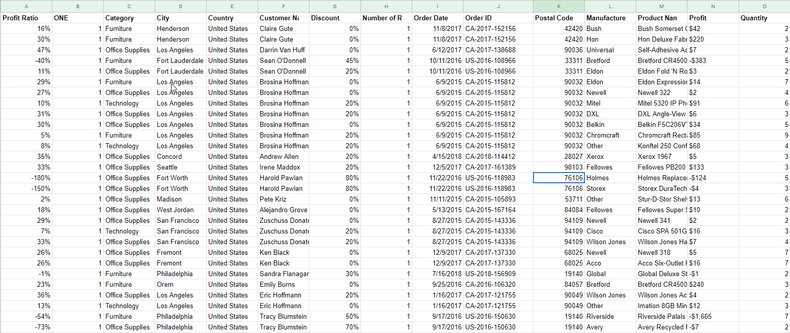
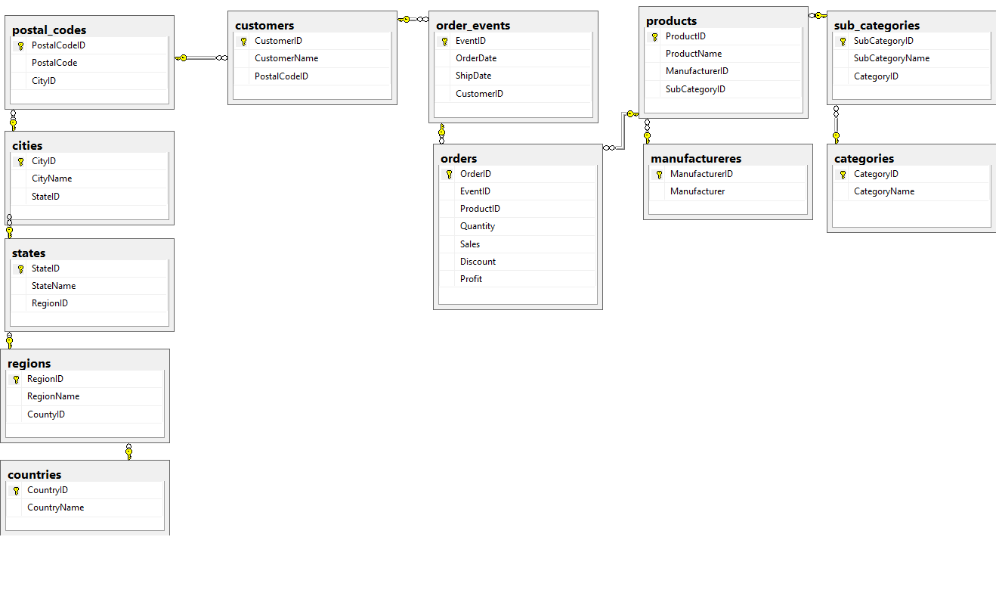

## Project: Convert company excel sheets to Relational DB

### Goal: 
The goal of this project is to convert a company's excel sheet with all the information's of the transactions the company has done the past years till now.

## Background: 
The company Sales Rocket (fiction name) has hired us as data analysts to fix their problem. They have realized that keeping all the order details in one excel sheet is not a great idea. The size of the data has grown so much that they can not anymore use them efficiently.

## Solution:
One word, Relational Databases. This kind of database can stores data with different levels of hierarchy and keeping the DB structured and well organized. 

## Walkthrough:
-  Analyze the RAW data (excel sheet): In this step, we have to see how the data looks like and with what types of data we have to work with. Are all the dates in the same format? Are the numerical values considered as such or as simple text? Are there long lines of text in fields such as comments or names that can introduce errors in the database?

- After answering all the questions and be sure that all the entries are as supposed to be its time to create the database. First, we create an Entity-Relationship Model (ERM) which is a raw representation of how our tables or entities is going to look like and what's the between relationships of the data.

-  Now its time to create a database to implements this ERM. Having all the entities and knowing the names, the types and the relationships of all the data is a great deal. In only some codes of SQL code, we fill the database with the data: Clean, Quick, Efficient.

- The biggest part of our work is already done. We have a clean DB with all the data and all the in-between relationships. Time to produce some insights from these data. The company can't wait to learn important pieces of information hidden so long in the messy excel sheet.

- With SQL code we answering the following: 
    - Which state is the most profitable?
    - Which city in this state is responsible most for this profit?
    - Which is the most profitable product?
    - Can we see all the transactions returning a specific profit?
    - Which month is most profitable in each year, in which state and which product was sold most then?

- Now the company has all this knowledge in a matter of seconds. And most important, can use the same SQL code, again and again, to reproduce new results in the years to come. How? We made Stored Procedures which can take a value as input, such a state name, and return all the information we need.

- The final step, keep the DB healthy and up to date. The company has two concerns: not to lose the data and how cans to share the DB in different departments to be analyzed for different reasons. The answer to the first concern is a tasked backup. Every 12 hours the DB is backed up completely automated so we have the most recent version of it. The second maintenance task is to create a replica. That means to have another version of our database looking alike as the original one with all or some of the data, so when a department makes a change the database will be updated too as real-time as possible (after we check the credentials of the change of course).

The project is finished, now we have a clean DB. Whats comes next is to analyze these data further to make some plots and come up with strategies to improve the value of the company.
***

Before:

After:

## TOOLS: 
    -   Microsoft SQL Server
    -   Visual Studio SQL Server Data tools
    -   Visual Studio Code 
    -   Microsoft Excel
