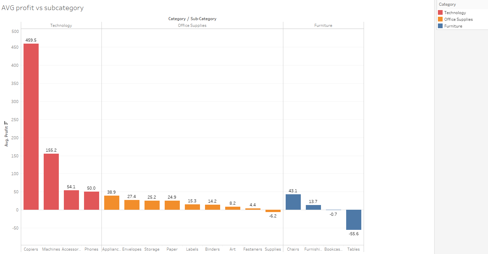

## Project: Visualizing Company’s Sales Data 
***
### Goal: 
The goal of this project is to understand business' data in-depth and make a sales analysis. We want to find out which practices are not a good fit for the company and make better choices for the sales market. All the project is done into Tableau 
***
## Background: 
We are working for the same company as the previous project. Now that we have created a structured Relational Database its time for us as analysts to make a search into the company's records and find out what is best for the company and what has to change. In the end, we have to come up with a presentation with all the important findings and record a video to be viewed from the company's director.
***
## Walkthrough:

The way we have to approach this task is to make ourselves as many questions we can, but always have in mind the **BIG Question**, this that the companies directors want to know the most. How are they gonna make more profit?
```
They say: How are we gonna make more profit?

We say: Which strategies can the company apply into the next year to have an increase in profit of 50%.
```
This is very important, to have the ability to translate the business goal into something *more efficient*, has *time-bound*, and is *measurable*. Now that we have made that clear and we know what are we looking for its time to dive into graphs.

### What about profit?
The first thing to do is to analyze how the profit is distributed for all the years the company is running. In general, a distribution plot can show us a lot of information about the data.


The profit is symmetric and well distributed, but we notice two negative points. 

    - Negative values, which indicates that for some reason the company had negative profit
    - And the very extream values, which are described by only 1 or 2 records.

The way we choose to go on is to mark the *outliers* as a separate set of data and leave the negative values of course because we want to find why is this happening.

### And the Revenue?

Now let's make the same analysis for the revenue.  Revenue is the sales the company makes without taking into consideration the expenses. In general 
```
profit = revenue - expenses
```


The distribution of the revenue doesn't look like the profit's distribution, we don't make negative revenue and the values are much higher that's why are represented into a logarithmic scale. Outliers are present but they don't cause such a big problem. What is more interesting is the most of the revenue comes from products with sales around 0 - 300K $


### AOV (Average Order Value)
We want to know now what is the average profit of an order. This metric will help us to understand the importance of an order at a specific period. Also will help us to give a quantitive value to each order. 
```
We calculate the Sum of profit for each distinct order for each month the company runs. After that, we calculated the average value of these values.
```


Tables are great but the human eye can not spot any abnormalities, so let's make a line graph.


Much better, and we can see that something was wrong with the January 2016. We notice that and consider for further analysis. But now that we calculated the AOV let's check, in which products categories we excel.

### Average Profit per Category/Sub-Category   

Now we will check the AVG profit in each Subgroup of all product categories we have.



At first look someone can say, Technology has better products, where Furniture has the worst. But let's not make quick assumptions yet. Tech products indeed bring more profit to the company but we want to find a strategy to increase that profit and having only expensive machines or other Technology products doesn't make much sense.

### How Profit is accumulated in each state?
Now, in the same way, we calculate the profit each state produce. But we have first to normalize the data, meaning we want to see how much profit each state makes taking into consideration the customers in each state.

```
We calculate the Sum of profit concerning the unique customers in each state.
```

This way we have a better a picture about the buying capabilities of the customers in each state. We can see in which states the customers are more keen to buy expensive products and in which the customers perform below average.


So now we can make two different target groups. One for the customers in the *strong states*, and one for those in *below-average states*

### Time for *time* analysis
Now let's make some analysis on how we perform focusing on time frames.

First, let's see what is the TBO(Time between orders). This will help us understand if we have long *dead* periods where the company had no orders. 


This is a quite huge graph to display it whole but 3 metrics are clear to see, the min, max and AVG values. Having a min of 1 day and a max of 4 is not so bad performance for a company. Maybe we can inspect what happened in these 4 days and we had no orders.

```
Knowing the AOV we can calculate the loss of each day without order.

26.2$ * #days = Loss in profit

```

Next, we analyze the time difference between the order date and ship date.


This time we labeled the results with the ship mode the customers used for the delivery. Again everything seems fine. We can deliver in good times with an average of 2.1 days.


### Customer behavior and trends
Now, in the final analysis, we take a look of three important things.

    - The customer order frequency
    - Cohort analysis
    - New customer acquisition

The order frequency analysis shows how oft a customer will place an order.


Oh, this is interesting 4800 customers bought only once from us and after that nothing. Only 94 bought a second time and 2 for the third time. The problem of the company is that it can't hold the customers loyal and make them return to place an order.

This will be shown better in the next graph of the Cohort analysis.


The last graph of our analysis will be the new customer acquisition. This will show which categories tend to bring to the company new customers.


## Conclusions

Having finished the analysis we have now a good picture of what is happening. 

- The company makes a negative profit and has some outliers which create a misunderstanding of the profit trend
- Most of the revenue comes from affordable products
- The company still operates in not so profitable states
- The company can not make the customers loyal
- The company stills sell products that are not so popular for customers.

Now let's see how a simple solution makes a noticeable difference. As analysts, we decide for the company
```
expand only across the Profitable states (Profit above average) and make there some new customers with some marketing campaign. Then must find out a way to keep them loyal with different offers or coupons. 
```
Also if there is the money and the time make further analysis to find out what happening into the below profit average states.

With only this simple change we see an increase in the AOV of 114%


## TOOLS:
- Tableau Public
- Microsoft  Excel

## Links
[Tableau Public Worksheets](https://public.tableau.com/profile/dimitrios7639#!/)

[Video Presentation of the Results](https://www.loom.com/share/098c90bb003a4bfcb77beff67323ffb4)
